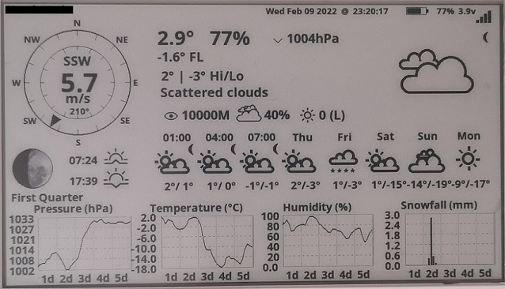
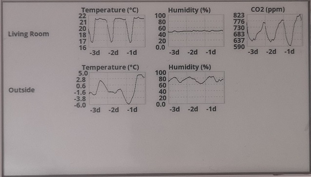

# Weather Display
The weather display is based on the [LilyGo T5 4.7" e-paper](https://www.aliexpress.com/item/1005002006058892.html).
It utilizes the buttons to switch between the current weather with forecast and past weather data that various sensors of mine collect around the home.

## Credits
The original code basis for this project is from [David Bird](https://github.com/G6EJD). Please head over to check out the great work David Bird is doing!
My main change on David's code is the additonal historical weather view.

## Shown content
<ul>
  <li>Current weather and forecast</li>
  <li>Historical weather</li>
</ul>
To switch between the different pages simply press button **IO34**.

Note: if you are only interested in the first page with current weather and forecast, then I strongly recommend to go with the original code from David Bird instead.

### Current weather and forecast
Shows current weather and forecast from [openweathermap.org](https://openweathermap.org/). 
Requires a free OWM account in order to get the data.

### Historical weather
Shows past weather gathered from various sensors around my house. The data is sourced from an InfluxDB2 database.
To keep the complexity and energy consumption for this project low, an agent is used as middleman which handles
all the InfluxDB2 related tasks like sending the flux queries and mapping the responses into something directly usable
for this project. This allows to control the shown information via the agent instead of needing to flash the LilyGo.

Instead of my agent any solution can be used as long as it provides an http endpoint that returns the data in the
required format.

For more information about the agent please see [influxdb2-agent](https://github.com/dtrumpfheller/influxdb2-agent).

## Usage
It is assumed that the **influxdb2-agent** is already up and running.
<ol>
  <li>Get LilyGo T5 4.7" e-paper</li>
  <li>Setup Arduino IDE 2.0</li>
  <li>Download and setup following libraries 
    <ol>
      <li>https://github.com/Xinyuan-LilyGO/LilyGo-EPD47</li>
      <li>https://github.com/bblanchon/ArduinoJson</li>
    </ol>
  </li>
  <li>Download this project and open in Arduino</li>
  <li>Update **properties.h** file based on your needs</li>
  <li>Upload sketch</li>
  <li>Enjoy :)</li>
</ol>

## TODOs
<ul>
  <li>Add support for more sensors, e.g. PM</li>
  <li>Add support for more than 3 locations</li>
  <li>Make use of all hardware buttons to switch between data</li>
  <li>Improve code</li>
</ul>
